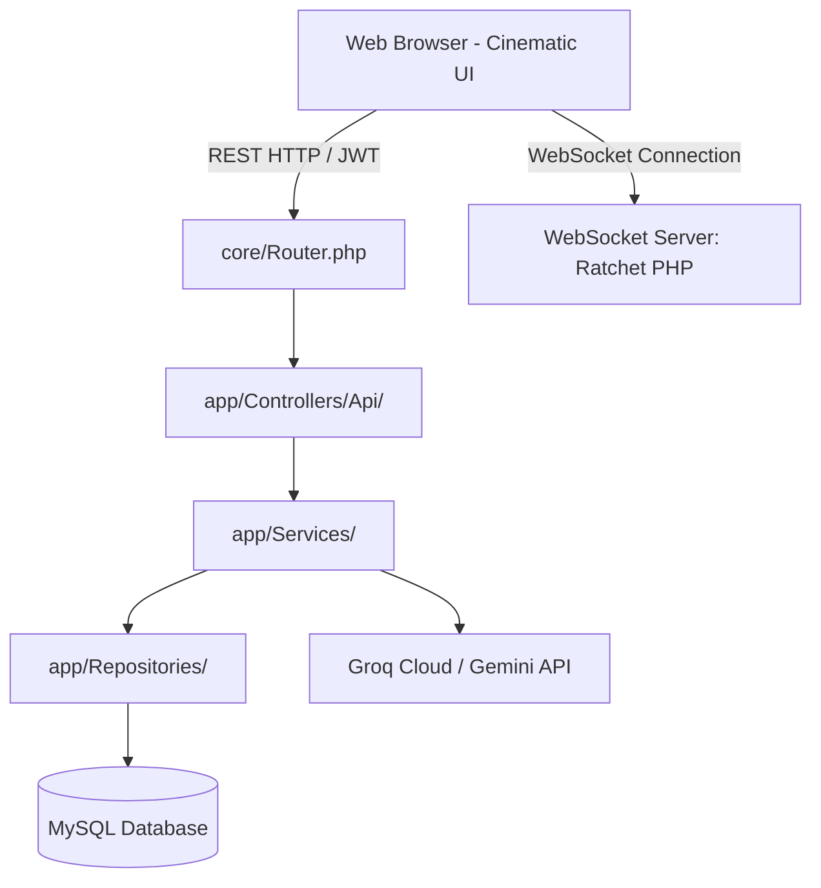

<div align="center">
  
  <h1>🎓 AI STUDY HUB LMS — CINEMATIC EDITION</h1>
  <p><strong>Nền tảng Quản lý Học tập Trực tuyến Thế hệ mới tích hợp Trợ lý AI Cá nhân hóa & Hệ thống Realtime Chat</strong></p>

  <p>
    
    
    
    
    
    
  </p>
</div>

---

## 📖 Giới Thiệu (The Vision)

**AI Study Hub LMS** không chỉ đơn thuần là một hệ quản trị học tập tĩnh; đây là một **Cinematic Learning Studio** cao cấp được phát triển dựa trên ngôn ngữ thiết kế **Dark Glassmorphism** hiện đại. Dự án được phát triển từ con số 0 (Scratch) với kiến trúc PHP MVC thuần túy nhằm tối ưu hiệu năng, nâng cao tính bảo mật và cung cấp khả năng can thiệp sâu vào các luồng dữ liệu học tập thông minh.

Dự án là đề tài thực tập tốt nghiệp được nghiên cứu và phát triển bởi nhóm sinh viên **Khoa Công nghệ Thông tin - Trường Đại học Khoa học, Đại học Huế**:
* **Lê Diễn Hiếu** (MSV: 22T1020610)
* **Nguyễn Duy Tín** (MSV: 22T1020466)

Hệ thống tập trung giải quyết 3 khoảng trống lớn của các LMS truyền thống:
1. **Trải nghiệm thị giác Cinematic**: Thiết kế giao diện tối hiện đại, sử dụng hiệu ứng kính mờ (glassmorphism), vi biên mềm và các chuyển động micro-animations giúp học viên tối đa hóa khả năng tập trung, khơi dậy hứng thú học tập.
2. **Cá nhân hóa lộ trình bằng Trí tuệ nhân tạo**: Trợ lý học thuật **AI Tutor** tích hợp có khả năng đọc hiểu ngữ cảnh (bản dịch transcript video, tóm tắt bài giảng, ghi chú của giảng viên) để giải đáp thắc mắc tức thời, loại bỏ triệt để hiện tượng AI nói sai lệch ngoài giáo án.
3. **Trao đổi Realtime & Bảo mật học liệu số**: Kết nối tương tác thời gian thực giữa giảng viên và học viên qua socket vĩnh viễn, kết hợp cơ chế mã hóa bảo vệ bản quyền video bài giảng chống tải lậu.

---

## ✨ Các Tính Năng Đột Phá & Module Cốt Lõi

### 🤖 1. Trợ Lý AI Tutor & Thuật Toán Context Injection
* **Bơm ngữ cảnh thông minh (Context Injection):** Trước khi chuyển tiếp câu hỏi của học viên lên API **Groq Cloud (LLaMA-3)**, hệ thống tự động truy vấn tổng hợp:
  * Video Transcript (Bản dịch lời thoại của video bài giảng hiện tại).
  * Ghi chú hướng dẫn chuyên sâu của Giảng viên nạp riêng cho bài học đó.
  * Tóm tắt bài học và từ khóa học thuật chính thức.
* **Chế độ AI nghiêm ngặt (Strict AI Mode):** Hệ thống chèn chỉ thị cứng bắt buộc AI chỉ được trả lời trong phạm vi học liệu cung cấp. Nếu học viên hỏi lạc đề, AI sẽ từ chối lịch sự và định hướng tập trung lại vào bài học chính.

### 💬 2. Kênh Realtime Chat (Ratchet PHP WebSocket)
* Thay thế hoàn toàn cơ chế Polling liên tục làm nghẽn máy chủ. Dự án dựng một dịch vụ **WebSocket Server** chạy dạng daemon process độc lập cổng `8080` bằng thư viện **Ratchet PHP**.
* Duy trì kết nối hai chiều liên tục (Persistent TCP Connection), định tuyến tin nhắn tức thời với độ trễ cực thấp (< 50ms). Lưu tin nhắn offline vào MySQL nếu đối phương không trực tuyến.

### 📹 3. Bảo Mật Video Bài Giảng (Token-based & Chunk-based Streaming)
* Toàn bộ tệp video bài giảng gốc được cô lập trong thư mục bảo mật ngoài vùng Apache (`storage/private/videos`), chặn truy cập trực tiếp bằng URL.
* Khi học viên xem bài học, hệ thống sinh ra một **Token ngắn hạn (hiệu lực 5 giây)** dùng một lần, mã hóa thông qua `AES-256`.
* Lớp điều khiển `VideoStreamController.php` giải mã token, xác thực quyền truy cập của học viên đối với khóa học đó, sau đó tiến hành truyền file video dưới dạng nhị phân theo từng phân đoạn nhỏ (**Chunk stream**) dựa trên HTTP Header `Content-Range`, vô hiệu hóa các công cụ bắt link tải lậu như IDM hoặc Cốc Cốc.

### 📝 4. Cơ Chế Tự Động Kiểm Duyệt (Change Tracking & Re-Approval Engine)
* Lớp dịch vụ `ChangeTrackingService.php` tự động ghi nhận và theo dõi các thay đổi cấu trúc dữ liệu cốt lõi (chương học, nội dung bài giảng, transcript, đáp án quiz).
* **Tự động chuyển trạng thái:** Nếu khóa học đã được xuất bản (`approved`) mà giảng viên chỉnh sửa nội dung bài giảng quan trọng, hệ thống tự động khóa trạng thái, chuyển về `"Chờ duyệt lại" (pending_reapproval)`.
* **Side-by-side Diff Viewer:** Admin nhận cảnh báo thông báo đỏ độ ưu tiên khẩn cấp và sử dụng trình so sánh trực quan (JSON Diff) để duyệt nhanh các nội dung thay đổi chỉ bằng 1 click chuột.

### 💳 5. Tự Động Ghi Danh & Thanh Toán VietQR
* Học viên quét mã VietQR động để ghi danh khóa học. 
* Tiền thanh toán được hệ thống backend xác thực bảo mật bằng việc gọi API lấy trực tiếp giá tiền khóa học lưu trong Database thay vì phụ thuộc thông tin giá truyền trên URL Client, ngăn chặn tuyệt đối các hành vi thay đổi giá từ phía client.

---

## 🏗️ Kiến Trúc Hệ Thống (Technical Blueprint)

Dự án được xây dựng theo chuẩn **Clean Architecture** phân tách rõ ràng trách nhiệm giữa các lớp mã nguồn nhằm tối ưu hóa khả năng bảo trì và nâng cấp mở rộng:



### Chi tiết các lớp kiến trúc:
* **Controller Layer:** Tiếp nhận Request từ Client, xác thực phân quyền qua hệ thống Middleware trung gian (`AuthMiddleware`, `RoleMiddleware`), điều phối luồng nghiệp vụ và phản hồi JSON chuẩn hóa.
* **Service Layer:** Tập trung toàn bộ logic nghiệp vụ cốt lõi của hệ thống (logic tạo prompt AI, logic theo dõi thay đổi dữ liệu, kiểm tra giao dịch thanh toán).
* **Repository Layer:** Đảm nhận nhiệm vụ truy vấn cơ sở dữ liệu. Toàn bộ mã SQL được viết thuần túy thông qua PDO kết hợp cơ chế Binding Parameters để ngăn chặn triệt để tấn công SQL Injection.

---

## 📂 Cấu Trúc Thư Mục Dự Án (Directory Structure)

```text
AIStudyHubLMS/
├── app/
│   ├── Controllers/       # Lớp điều hướng (Student, Teacher, Admin, Api)
│   ├── Middleware/        # Các bộ lọc phân quyền (JWT Auth, Role checking)
│   ├── Models/            # Các thực thể dữ liệu ánh xạ
│   ├── Repositories/      # Nơi thực thi các truy vấn SQL PDO MySQL
│   └── Services/          # Nơi xử lý logic nghiệp vụ cốt lõi (AI, Chat, Tracking, Payment)
├── core/
│   ├── Database.php       # Khởi tạo kết nối PDO với chuẩn charset utf8mb4
│   ├── Request.php        # Phân tích dữ liệu, header, cookie và token gửi lên
│   ├── Response.php       # Chuẩn hóa phản hồi JSON đầu ra
│   └── Router.php         # Bộ điều tuyến API HTTP động
├── database/
│   ├── migration_v4.sql   # File cấu trúc dữ liệu cập nhật
│   └── aistudyhublms.sql  # Cơ sở dữ liệu mẫu ban đầu
├── docker/                # Các file cấu hình môi trường Container
├── public/                # Phân vùng công khai của Web Server (index.php)
│   ├── assets/            # CSS, JavaScript, Fonts, i18n
│   ├── student/           # Giao diện dành cho học viên
│   ├── teacher/           # Giao diện dành cho giảng viên
│   └── admin/             # Giao diện bảng điều khiển dành cho Admin
├── routes/
│   ├── api.php            # Định nghĩa danh sách các Endpoint RESTful API
│   └── web.php            # Định nghĩa các Route giao diện
├── storage/
│   ├── private/           # Thư mục chứa video bài giảng gốc bảo mật
│   └── public/            # Chứa các tài nguyên tải lên công khai (avatar, cover)
├── docker-compose.yml     # File thiết lập và khởi chạy hệ sinh thái Docker
├── Dockerfile             # Thiết lập Image cho Apache & PHP Container
├── server.php             # Điểm chạy máy chủ WebSocket Ratchet Daemon
└── readme.md              # Tài liệu hướng dẫn sử dụng dự án
```

---

## 🚀 Hướng Dẫn Cài Đặt & Triển Khai (Quick Start)

Hệ thống hỗ trợ 2 cơ chế chạy: triển khai nhanh bằng **Docker Compose** (Khuyến nghị) hoặc cài đặt thủ công.

### Phương án 1: Triển khai nhanh bằng Docker Compose (Khuyến nghị)

Toàn bộ môi trường đã được container hóa khép kín. Bạn chỉ cần thực hiện 2 bước sau:

**Bước 1: Khởi tạo biến môi trường**
Sao chép file `.env.example` thành `.env` ở thư mục gốc:
```bash
cp .env.example .env
```
Cấu hình các thông số kết nối Database nội bộ Docker (giữ nguyên mặc định) và nhập Groq API key:
```env
DB_HOST=aistudyhub_db
DB_PORT=3306
DB_NAME=ai_study_hub_lms
DB_USER=root
DB_PASS=root
DB_CHARSET=utf8mb4

GROQ_API_KEY=your_groq_api_key_here
JWT_SECRET=your_jwt_secret_key_here
```

**Bước 2: Khởi chạy docker compose**
Thực thi duy nhất câu lệnh sau ở thư mục chứa dự án:
```bash
docker-compose up --build
```
* **aistudyhub_web** (Apache/PHP 8.2) chạy tại cổng: `http://localhost:8080`
* **aistudyhub_websocket** (Ratchet server) chạy tại cổng: `8080` (giao tiếp socket nội bộ)
* **aistudyhub_db** (MySQL 8.0) tự động nạp cấu hình và duy trì dữ liệu bền vững.

---

### Phương án 2: Cài đặt và cấu hình thủ công

**Yêu cầu môi trường:**
* PHP phiên bản `8.1` hoặc cao hơn.
* MySQL phiên bản `8.0` hoặc cao hơn.
* Trình quản lý thư viện Composer.

**Các bước thực hiện:**

1. **Tải mã nguồn và cài đặt thư viện:**
   ```bash
   git clone https://github.com/hieule52/ai-study-hub-v2.git
   cd AIStudyHubLMS
   composer install
   composer dump-autoload
   ```

2. **Cấu hình môi trường (`.env`):**
   Tạo file `.env` từ mẫu `.env.example` và thiết lập các thông số kết nối cơ sở dữ liệu MySQL máy vật lý của bạn cùng mã Groq API Key.

3. **Khởi tạo Cơ sở dữ liệu:**
   * Import file CSDL mẫu `database/aistudyhublms.sql` vào MySQL Server của bạn.
   * Chạy tiếp file cập nhật cấu trúc `database/migration_v4.sql` để bổ sung các bảng quản lý lịch sử so sánh dữ liệu và hàng đợi thông báo kiểm duyệt admin.

4. **Khởi chạy các máy chủ:**
   * **Mở Terminal 1 - Chạy máy chủ Web:**
     ```bash
     php -S localhost:8000 -t public
     ```
     Trang web của bạn sẽ hoạt động tại địa chỉ: `http://localhost:8000`
   
   * **Mở Terminal 2 - Chạy máy chủ WebSocket (Chat realtime):**
     ```bash
     php server.php
     ```
     Tiến trình sẽ chạy ngầm và lắng nghe kết nối thời gian thực tại cổng `8080`.

---

## 👥 Tài Khoản Trực Nghiệm Hệ Thống (Demo Accounts)

Để thuận tiện cho quá trình kiểm thử đầy đủ các vai trò tác nhân, bạn có thể đăng nhập bằng các tài khoản mặc định sau:

| Tác nhân | Tài khoản (Email) | Mật khẩu mặc định | Điểm nhấn kiểm thử |
| :--- | :--- | :--- | :--- |
| **Học viên** | `student@aistudyhub.edu.vn` | `123456` | Học tập bài giảng video bảo mật, gửi câu hỏi cho AI Tutor, chat realtime với giảng viên, quét VietQR ghi danh. |
| **Giảng viên** | `teacher@aistudyhub.edu.vn` | `123456` | Chỉnh sửa chương trình giảng dạy, nạp tài liệu riêng tư hướng dẫn AI, bật/tắt Strict AI Mode, trả lời chat học viên. |
| **Admin** | `admin@aistudyhub.edu.vn` | `123456` | Quản trị người dùng, nhận cảnh báo đỏ kiểm duyệt khóa học và thực hiện so sánh phê duyệt khóa học qua Side-by-side Diff Viewer. |

---

## 🔒 Bản Quyền & Sở Hữu Trí Tuệ (Proprietary & Intellectual Property)

* **Sở hữu độc quyền:** Toàn bộ mã nguồn, cấu trúc dữ liệu, tài liệu thiết kế và giao diện đồ họa của hệ thống **AI Study Hub LMS** thuộc quyền sở hữu trí tuệ độc quyền của hai tác giả thực hiện đề tài tốt nghiệp (**Lê Diễn Hiếu** & **Nguyễn Duy Tín** - Khoa Công nghệ Thông tin, Trường Đại học Khoa học, Đại học Huế).
* **Quy định bảo mật & Phân phối:**
  * Đây là dự án phục vụ bảo vệ đề tài tốt nghiệp chính thức, được quản lý dưới dạng **Mã nguồn đóng (Closed-Source)**.
  * **NGHIÊM CẤM** mọi hành vi sao chép, tải về tự do, sao chép cấu trúc, chỉnh sửa, tái phân phối hoặc thương mại hóa mã nguồn dưới bất kỳ hình thức nào khi chưa có sự cho phép bằng văn bản từ các tác giả sở hữu.
  * Mọi hành vi vi phạm bản quyền phần mềm và học thuật sẽ bị xử lý nghiêm khắc theo Quy chế đào tạo của nhà trường và Luật Sở hữu trí tuệ hiện hành.

---
<div align="center">
  <p><em>"Building the future of digital learning, one secure connection at a time."</em></p>
</div>
