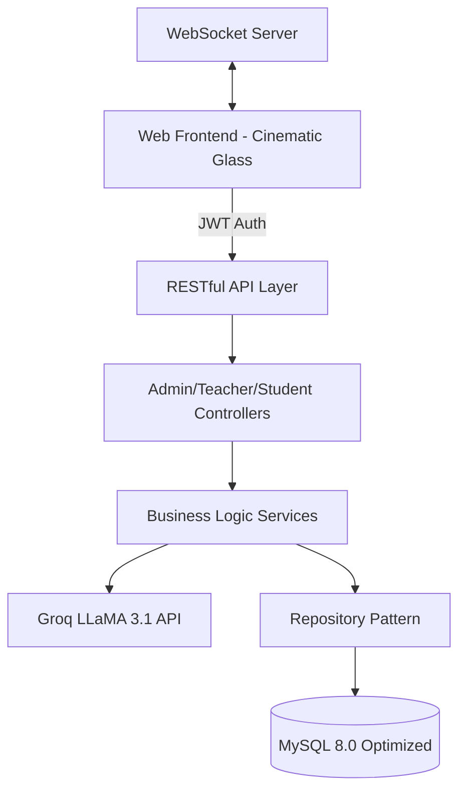

<div align="center">
  
  <h1>🎓 AI STUDY HUB LMS — CINEMATIC EDITION</h1>
  <p><strong>Nền tảng Học tập Trực tuyến Thế hệ mới với Trải nghiệm Điện ảnh & Trợ lý AI</strong></p>

  <p>
    
    
    
    
    
  </p>
</div>

---

## 📖 Giới Thiệu (The Vision)

**AI Study Hub LMS** không chỉ là một hệ thống quản lý học tập; đó là một **Learning Studio** cao cấp được thiết kế theo ngôn ngữ "Cinematic Dark Glass". Chúng tôi tập trung vào việc xóa bỏ sự nhàm chán của các LMS truyền thống bằng cách kết hợp:

1.  **Thẩm mỹ Điện ảnh (Cinematic Aesthetics)**: Giao diện tối hiện đại, sử dụng hiệu ứng Glassmorphism (kính mờ), chuyển động mượt mà và hệ thống Typography editorial.
2.  **Trí tuệ Nhân tạo Cá nhân hóa**: Tích hợp LLaMA 3.1 bám sát nội dung từng bài giảng để hỗ trợ học viên 24/7.
3.  **Vận hành Hiệu suất cao**: Kiến trúc mã nguồn được tối ưu hóa sâu (Database Indexing, Repository Pattern) đảm bảo hệ thống luôn mượt mà dù quy mô dữ liệu lớn.

---

## ✨ Các Tính Năng Đột Phá

### 🎬 Giao diện Cinematic Dark Glass
- **Premium UI/UX**: Được xây dựng hoàn toàn bằng Vanilla CSS để đạt tới độ tinh tế cao nhất, không phụ thuộc vào các framework UI đại trà.
- **Micro-animations**: Các hiệu ứng hover, chuyển trang và tương tác card mang lại cảm giác sống động và cao cấp.
- **Responsive Admin Portal**: Cổng quản trị hoàn toàn mới, tách biệt logic navigation, tối ưu cho việc điều hành trên mọi thiết bị.

### 🤖 Trợ Lý AI Tutor (Context-Aware)
- **Học tập thông minh**: AI tự động đọc hiểu toàn bộ nội dung bài giảng hiện tại để giải đáp thắc mắc chính xác cho học viên.
- **Coding Buddy**: Hỗ trợ giải thích mã nguồn, debug và tạo bài tập code thực tế ngay trong khung chat.

### 📊 Hệ Thống Quản Trị Module (Admin Control Center)
- **Doanh thu ghi danh**: Thay thế các mô hình thương mại điện tử phức tạp bằng luồng thống kê doanh thu ghi danh trực tiếp, trực quan.
- **Course Review System**: Quy trình duyệt khóa học chuyên nghiệp với chế độ **Preview Mode** (xem trước cinematic) dành riêng cho Admin.
- **Audit Logs**: Theo dõi toàn bộ biến động hệ thống với các Action Badges (INSERT, UPDATE, DELETE) màu sắc rõ ràng.

### 🔒 Bảo mật & Tối ưu hóa
- **Signed Video Tokens**: Bảo vệ video bài giảng bằng HMAC-SHA256, chống download trái phép.
- **DB Optimization**: Hệ thống Indexing tổ hợp (Composite Indexes) giúp các thao tác lọc dữ liệu và thống kê diễn ra gần như tức thì.

---

## 🏗️ Kiến Trúc Hệ Thống (Technical Blueprint)

Dự án áp dụng mô hình **MVC + Repository + Service Pattern** để đảm bảo khả năng mở rộng và bảo trì dễ dàng.



---

## 👥 Phân Quyền & Vai Trò

| Vai trò | Điểm nhấn tính năng |
| :--- | :--- |
| **Học viên** | Học tập với AI, làm Quiz, nhận Chứng chỉ tự động và thanh toán học phí qua VietQR. |
| **Giảng viên** | Studio tạo bài giảng cinematic, quản lý học viên, thống kê doanh thu và hỗ trợ qua Chat. |
| **Quản trị viên** | Kiểm soát toàn hệ thống, duyệt khóa học qua Preview Mode, quản lý logs và tài khoản. |

---

## 🚀 Hướng Dẫn Cài Đặt (Quick Start)

### 1. Khởi tạo Dự án
```bash
git clone https://github.com/hieule52/ai-study-hub-v2.git
cd AIStudyHubLMS
composer install
composer dump-autoload
```

### 2. Cấu hình Môi trường
Tạo file `.env` từ mẫu `.env.example` và thiết lập các thông số:
- **DB_***: Thông tin kết nối MySQL.
- **GROQ_API_KEY**: Key để kích hoạt Trợ lý AI.
- **JWT_SECRET**: Khóa bảo mật cho hệ thống đăng nhập.

### 3. Database & Servers
1. Import `database/aistudyhublms.sql` vào MySQL.
2. Chạy Server Web: `php -S localhost:8000 -t public`
3. Chạy Server Real-time: `php server.php`

---

## 📄 Bản Quyền & Phát triển

Dự án được thực hiện bởi **Lê Diên Hiếu** với mục tiêu nâng tầm trải nghiệm giáo dục số tại Việt Nam.

- **Email**: `lehieu2900.in@gmail.com`
- **License**: MIT License (Tự do sử dụng & phát triển thêm).

<div align="center">
  <p><em>"Building the future of learning, one frame at a time."</em></p>
</div>
